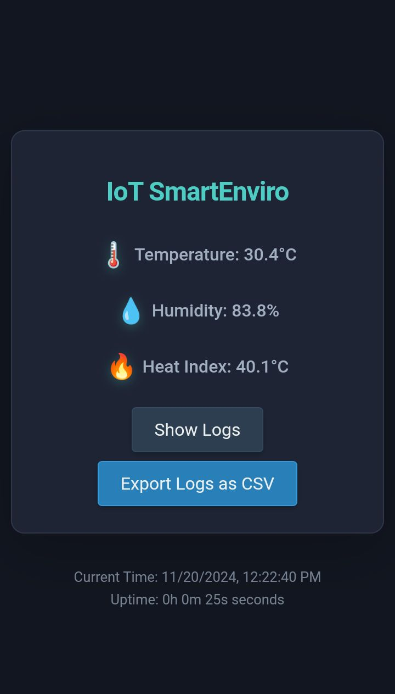
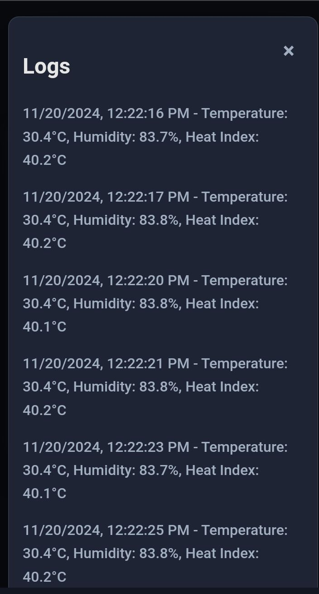

## User Interface Design

  
  

## Features
- **Wi-Fi Access Point:**
  - Hosts an User interface for monitoring data.
  - Automatically shuts down Access Point if no clients connected to save power.
    
- **Environmental Monitoring:**
  - Measures temperature, humidity, and calculates heat index using the Adafruit AHTX0 sensor.
  - Real-time data updates via WebSocket.
    
- **Motion Detection:**
  - Detects motion using the RCWL-0516 microwave radar sensor and triggers an audible buzzer and Turn On LED lights.
  - Automatically turns off Buzzer and LED lights after a Timeout.

## Pin Configuration
| Component        | GPIO Pin |
|-------------------|----------|
| Passive Buzzer    | GPIO1    |
| LED               | GPIO4    |
| RCWL-0516         | GPIO5    |
| AHT30 (I2C SDA)   | GPIO21   |
| AHT30 (I2C SCL)   | GPIO22   |
